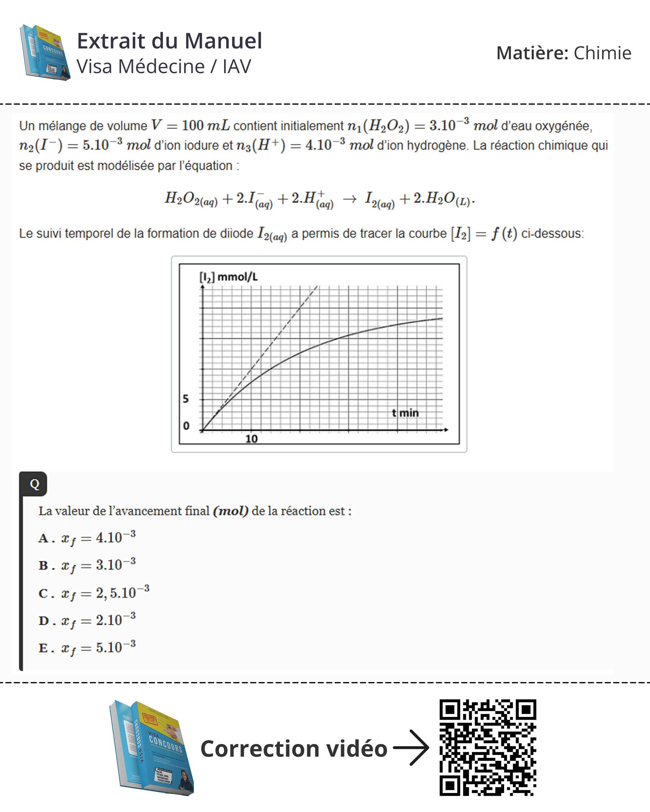
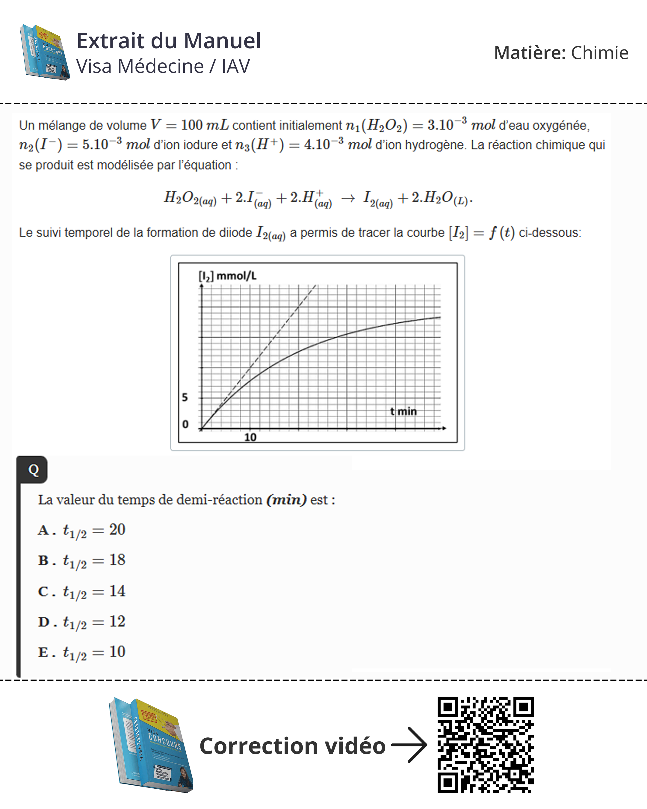

# 🔬 Chimie – Extraits du Manuel Visa Médecine (Version Démo)

Ce dossier contient des extraits du manuel _Visa Médecine_ pour la préparation en Chimie du concours de médecine au Maroc.  
Ces extraits permettent aux candidats de découvrir la structure des exercices et QCM proposés dans la formation.

---

## 📄 Extraits inclus

Voici quelques pages extraites du manuel :

  

> _Les images ci-dessus sont des aperçus tirés de la version démo._

---

## 🎥 Corrections – Vidéos d’explications (Version Déмо)

Les vidéos sont disponibles en double hébergement pour assurer la pérennité des liens.

### Archive.org (source principale)

- ▶️ [Correction – Question N°1](https://archive.org/details/q-1_20251114_202511)
- ▶️ [Correction – Question N°2](https://archive.org/details/q-2_20251114_202511)

### YouTube (miroir)

- ▶️ [Correction – Question N°1](https://youtu.be/zk673sHX7uA)
- ▶️ [Correction – Question N°2](https://youtu.be/uPMgw2f8VoQ)

---

## 📘 Contenu proposé dans ce répertoire

- QCM de Chimie (extraits)
- Exercices types concours
- Explications vidéo

**⚠️ Ces extraits ne représentent qu’une partie limitée du manuel complet.**

---

## 🎓 Accès à la Formation Complète

Pour aller plus loin dans votre préparation, vous pouvez accéder aux ressources complètes :

### 📘 Manuel Complet _Visa Médecine_

Accédez au manuel intégral, aux QCM complets et aux corrigés vidéo :  
👉 https://medecine.visaconcours.ma/correction/chimie

### 🎓 Préparation au Concours (Présentiel & Distanciel)

Rejoignez la préparation complète au concours de médecine, disponible en **présentiel** et **en ligne** :  
👉 https://concours.visaschool.ma/preparation-concours/medecine

---

**Visa Médecine – Votre partenaire vers la réussite au concours de médecine.**
